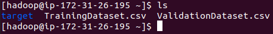

# Wine Quality Prediction

- [Wine Quality Prediction](#wine-quality-prediction)
  - [1. Parallel training implementation](#1-parallel-training-implementation)
  - [2. Single machine prediction](#2-single-machine-prediction)
  - [3. Docker container for prediction](#3-docker-container-for-prediction)
      - [Link to Docker Container](#link-to-docker-container)
  - [4. Terraform - Automation of the infrastructure](#4-terraform---automation-of-the-infrastructure)
  - [5. CI/CD GitHub Action](#5-cicd-github-action)

## 1. Parallel training implementation
* Create a cluster

We create a cluster of **5 nodes (1 master 4 slaves)** to train a ML model to predict the quality of the wine.
We use **AWS EMR** cluster management tool to achieve this.


* Upload files to the s3 bucket

On creating the cluster, we will have access to the s3 bucket attached to the cluster.


Upload the `target` containing the jar file `Trainer-1.0-SNAPSHOT.jar` & `dataset` to the bucket.

`target` folder is generated when you type `mvn-compile-package`.


Login to the `master` instance & pull the files from s3 bucket.

```
aws s3 cp s3://aws-logs-612956122687-us-east-1/elasticmapreduce/j-33M8LH0D9HLMD/dataset/ ./ --recursive
aws s3 cp s3://aws-logs-612956122687-us-east-1/elasticmapreduce/j-33M8LH0D9HLMD/target ./target --recursive
```




First we need to make these files available to the slave nodes.
```
hadoop fs -put TrainingDataset.csv
hadoop fs -put ValidationDataset.csv
```

We can confirm the accessibility of the files using
```
hdfs dfs -ls -t -R
```


Now we can start training. We use `spark-submit` command to run the jar file.
```
spark-submit target/Trainer-1.0-SNAPSHOT.jar
```


This will create a `model/ModelTrained` folder and store trained model to it.
Verify model is created by executing following :
```
hdfs dfs -ls -t -R
```


Copy This folder back to our master node using following
```
hdfs dfs -copyToLocal model/ModelTrained /home/hadoop/wine_quality
```

Zip it

```
tar czf model.tar.gz wine_quality
```

Download the file to your local machine (sftp or filezilla).

## 2. Single machine prediction

Ssh into your ec2 instance.
Make sure scala (v2) & spark (v2) are installed on your ec2. 

Go to `pom.xml` file and change MainClass to `Testor`
```
<mainClass>Testor</mainClass>
```

Then recompile your project

Upload the `target`, `dataset`, & `model.tar.gz` to your ec2
Extract model.tar.gz
```
tar -xzvf model.tar.gz
```

Now we can start training. We use `spark-submit` command to run the jar file.
```
spark-submit target/Trainer-1.0-SNAPSHOT.jar
```


## 3. Docker container for prediction

#### Link to Docker Container

* [Docker Container](https://hub.docker.com/repository/docker/srd22/wine_quality)

Now we're going to build our docker image & create a container out of it.

Make sure you are login to docker.io on your local machine

First, copy `target`, `dataset`, `model` files to a new folder (say `docker`)

Then run the command:
```
docker build -t srd22/wine_quality .
```


Next publish the container:
```
docker push srd22/wine_quality .
```


Then go to your ec2 and use following command to run the docker
```
docker run --mount type=bind,source=/home/ec2-user/TestingDataset.csv,target=/TestingDataset.csv srd22/wine_quality
```


## 4. Terraform - Automation of the infrastructure

Set the following as Environment variables -`AWS_ACCESS_KEY_ID_ROOT`, `AWS_SECRET_ACCESS_KEY_ROOT`, `AWS_REGION`

1. Run [scripts/root_setup.sh](https://github.com/shaswat-dharaiya/ML-Spark/blob/main/scripts/root_setup.sh) script to perform root level environment setup.
   * Executes [infrastructure/user/create_user.tf](https://github.com/shaswat-dharaiya/ML-Spark/blob/main/infrastructure/user/create_user.tf) that will create `IAM User`, `Role`, `Profile`, and `Security Group`

2. Run [scripts/setup_train.sh](https://github.com/shaswat-dharaiya/ML-Spark/blob/main/scripts/setup_train.sh) script to create the EMR Cluster & Train the model.
   * Executes [infrastructure/buckets/create_bucket.tf](https://github.com/shaswat-dharaiya/ML-Spark/blob/main/infrastructure/buckets/create_bucket.tf) that creates an S3 bucket if not present. Populate it with a `tar` file that contains the dataset and application `jar` file.
   * Executes [infrastructure/cluster/create_cluster.tf](https://github.com/shaswat-dharaiya/ML-Spark/blob/main/infrastructure/cluster/create_cluster.tf) that creates an EMR Cluster to train the model.
     1. Executes `Bootstrap Action` - [scripts/user_script_ec2.sh](https://github.com/shaswat-dharaiya/ML-Spark/blob/main/scripts/user_script_ec2.sh), that sets up file structure on emr cluster.
     2. Executes `Spark Step` - [scripts/spark_steps.sh](https://github.com/shaswat-dharaiya/ML-Spark/blob/main/scripts/spark_steps.sh), that trains a model on emr and uploads the model to S3 bucket.

3. Run [scripts/setup_test.sh](https://github.com/shaswat-dharaiya/ML-Spark/blob/main/scripts/setup_test.sh) script to test the model on an ec2.
    * Executes [infrastructure/instance/create_instance.tf](https://github.com/shaswat-dharaiya/ML-Spark/blob/main/infrastructure/instance/create_instance.tf) that creates an EC2 instance Populate it with a `tar` file that contains the dataset and application `jar` file.
    * Executes [scripts/testing_script.sh](https://github.com/shaswat-dharaiya/ML-Spark/blob/main/scripts/testing_script.sh) script to setup a Spark + Hadoop Environment on ec2 and executes `spark-submit` to test the model.

## 5. CI/CD GitHub Action

Achieves CI/CD using Github Action that will retrain the model if there are some changes made to the source code:

```yml
on:
# Conditions for an event to be triggered.
  push:
    branches:
      - main
    paths: 
      - src/main/java/*
```


> [scripts/setup_train.sh](https://github.com/shaswat-dharaiya/ML-Spark/blob/main/scripts/setup_train.sh) will be executed to retrain the model.


```yml
# A workflow run is made up of one or more jobs that can run sequentially or in parallel
jobs:
  # This workflow contains a single job called "build"
  build:
    # The type of runner that the job will run on
    runs-on: ubuntu-latest
    steps:
      - uses: actions/checkout@master
      - name: Sync & Train
        run: sh ./scripts/setup_train.sh
        env:
          AWS_REGION: ${{ secrets.AWS_REGION_USER }}
          AWS_ACCESS_KEY_ID: ${{ secrets.AWS_ACCESS_KEY_ID_USER }}
          AWS_SECRET_ACCESS_KEY: ${{ secrets.AWS_SECRET_ACCESS_KEY_USER }}
```