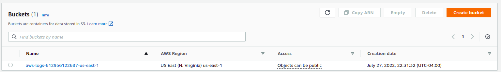

# Wine Quality Prediction

## Links

* [Github](https://github.com/shaswat-dharaiya/ML-Spark)

* [Docker](https://hub.docker.com/repository/docker/srd22/wine_quality)

## 1. Parallel training implementation
* Create a cluster

We create a cluster of **5 nodes (1 master 4 slaves)** to train a ML model to predict the quality of the wine.
We use **AWS EMR** cluster management tool to achieve this.


* Upload files to the s3 bucket

On creating the cluster, we will have access to the s3 bucket attached to the cluster.



Upload the `target` containing the jar file `Trainer-1.0-SNAPSHOT.jar` & `dataset` to the bucket.

`target` folder is generated when you type `mvn-compile-package`.


Login it to the `master` instance & pull the files from s3 bucket.

```
aws s3 cp s3://aws-logs-612956122687-us-east-1/elasticmapreduce/j-33M8LH0D9HLMD/dataset/ ./ --recursive
aws s3 cp s3://aws-logs-612956122687-us-east-1/elasticmapreduce/j-33M8LH0D9HLMD/target ./target --recursive
```


First we need to make these files available to the slave nodes.
```
hadoop fs -put TrainingDataset.csv
hadoop fs -put ValidationDataset.csv
```

We can confirm the accessibility of the files using
```
hdfs dfs -ls -t -R
```


Now we can start training. We use `spark-submit` command to run the jar file.
```
spark-submit target/Trainer-1.0-SNAPSHOT.jar
```


This will create a `data/TrainingModel` folder and store trained model to it.
Verify model is created by executing following :
```
hdfs dfs -ls -t -R
```


Copy This folder back to our master node using following
```
hdfs dfs -copyToLocal data/TrainingModel /home/hadoop/wine_quality
```

Zip it

```
tar czf model.tar.gz wine_quality
```

Download the file to your local machine (sftp or filezilla).

## 2. Single machine prediction

Ssh into your ec2 instance.
Make sure scala (v2) & spark (v2) are installed on your ec2. 

Go to `pom.xml` file and change MainClass to `Testor`
```
<mainClass>Testor</mainClass>
```

Then recompile your project

Upload the `target`, `dataset`, & `model.tar.gz` to your ec2
Extract model.tar.gz
```
tar -xzvf model.tar.gz
```

Now we can start training. We use `spark-submit` command to run the jar file.
```
spark-submit target/Trainer-1.0-SNAPSHOT.jar
```


## 3. Docker container for prediction

Now we're going to build our docker image & create a container out of it.

Make sure you are login to docker.io on your local machine

First, copy `target`, `dataset`, `model` files to a new folder (say `docker`)

Then run the command:
```
docker build -t srd22/wine_quality .
```


Next publish the container:
```
docker push srd22/wine_quality .
```


Then go to your ec2 and use following command to run the docker
```
docker run --mount type=bind,source=/home/ec2-user/TestingDataset.csv,target=/TestingDataset.csv srd22/wine_quality
```
